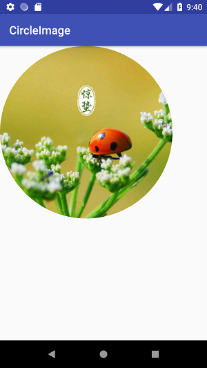

# CircleImage

## 说明
将图片自动转换为圆形

## 效果图
 

## How to use
To get a Git project into your build:

**Step 1**. Add the JitPack repository to your build file
Add it in your root build.gradle at the end of repositories:
>     allprojects {
>         repositories {
>             ...
>             maven { url 'https://jitpack.io' }
>         }
>     }

**Step 2**. Add the dependency
>     dependencies {
>         compile 'com.github.SimonX15:CircleImage:v0.3'
>     }